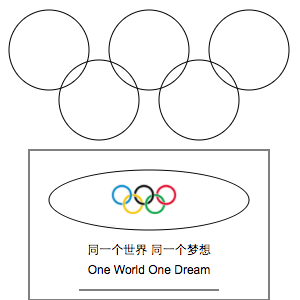

# react-raphael

[](https://www.npmjs.com/package/react-raphael)
[](https://www.npmjs.com/package/react-raphael)

reactify raphael

## Install

	npm install --save react-raphael

## Example

- [react-raphael-example](https://github.com/liuhong1happy/react-raphael-example)
- [react-raphael-map](https://github.com/liuhong1happy/react-raphael-map)

## Quickly Start

```js
var React = require('react');
var ReactDOM = require('react-dom');

const {Raphael,Paper,Set,Circle,Ellipse,Image,Rect,Text,Path} = require('react-raphael');

class App extends React.Component{
    render(){
        var data = [
            {x:50,y:50,r:40,attr:{"stroke":"#0b8ac9","stroke-width":5},animate:Raphael.animation({cx:60},500,"<>")},
            {x:100,y:100,r:40,attr:{"stroke":"#f0c620","stroke-width":5},animate:Raphael.animation({cx:105},500,"<>")},
            {x:150,y:50,r:40,attr:{"stroke":"#1a1a1a","stroke-width":5}},
            {x:200,y:100,r:40,attr:{"stroke":"#10a54a","stroke-width":5},animate:Raphael.animation({cx:195},500,"<>")},
            {x:250,y:50,r:40,attr:{"stroke":"#e11032","stroke-width":5},animate:Raphael.animation({cx:240},500,"<>")}
        ]
        return (<Paper width={300} height={300}>
                       <Set>    
                        {
                            data.map(function(ele,pos){
                                return (<Circle key={pos} x={ele.x} y={ele.y} r={ele.r} attr={ele.attr} animate={ele.animate}/>)
                            })
                        }
                        </Set>
						<Set>
                            <Rect x={30} y={148} width={240} height={150} attr={{"fill":"#10a54a","stroke":"#f0c620","stroke-width":5}}/>
							<Ellipse x={150} y={200} ry={40} rx={100} attr={{"fill":"#fff","stroke":"#e11032"}} glow={{width:100,fill:true,color:"#e11032",opacity:1}}/>
                            <Image src="/static/images/5circle.png" x={100} y={170} width={90} height={60} />
							<Text x={150} y={250} text="同一个世界 同一个梦想" attr={{"fill":"#fff"}}/>
							<Text x={150} y={270} text="One World One Dream" attr={{"fill":"#fff"}}/>
							<Path d={["M80 290L220 290"]} attr={{"stroke":"#fff"}}/>
						</Set>
                </Paper>)
    }
}
```

## Snapshot



## API

#### All Element Props

- Paper 
    - width `number` width of the canvas
    - height  `number` height of the canvas
- Element
	- attr `object` Sets the attributes of the element.
	- animate `object` Creates and starts animation for given element.
	- animateWith `object` Acts similar to Element.animate, but ensure that given animation runs in sync with another given element.
	- click `function` Adds event handler for click for the element.
	- dblclick `function` Adds event handler for double click for the element.
	- drag `function` Adds event handlers for drag of the element.
	- glow `function` Return set of elements that create glow-like effect around given element.
	- hover `function` Adds event handlers for hover for the element.
	- hide `boolean` Makes element invisible. 
	- mousedown `function` Adds event handler for mousedown for the element.
	- mousemove `function` Adds event handler for mousemove for the element.
	- mouseout `function` Adds event handler for mouseout for the element.
	- mouseover `function` Adds event handler for mouseover for the element.
	- mouseup `function` Adds event handler for mouseup for the element.
    - load `function` Adds event handler for load for the element.
	- rotate `object` Adds rotation by given angle around given point to the list of transformations of the element.
	- scale `object` Adds scale by given amount relative to given point to the list of transformations of the element.
	- toBack `boolean` Moves the element so it is the furthest from the viewer’s eyes, behind other elements.
	- toFront `boolean` Moves the element so it is the closest to the viewer’s eyes, on top of other elements.
	- touchcancel `function` Adds event handler for touchcancel for the element.
	- touchend `function` Adds event handler for touchend for the element.
	- touchmove `function` Adds event handler for touchmove for the element.
	- touchstart `function` Adds event handler for touchstart for the element.
	- transform `string` or `array` Adds transformation to the element which is separate to other attributes, i.e. translation doesn’t change x or y of the rectange. The format of transformation string is similar to the path string syntax:`"t100,100r30,100,100s2,2,100,100r45s1.5"`
	- translate `object` Adds translation by given amount to the list of transformations of the element.
- Set `Extends Element & Container Elements`
- Circle  `Extends Element & Draws a circle`
    - x `number` x coordinate of the centre
    - y `number` y coordinate of the centre
    - r `number` radius
- Ellipse `Extends Element & Draws a ellipse`
    - x `number` x coordinate of the centre
    - y `number` y coordinate of the centre
    - rx `number` horizontal radius
	- ry `number` vertical radius
- Image `Extends Element & Embeds an image into the surface`
	- src `string` URI of the source image
    - x `number` x coordinate of the centre
    - y `number` y coordinate of the centre
    - width `number` width of the image
	- height `number` height of the image
- Path `Extends Element & Creates a path element by given path data string`
    - d `string` path string in SVG format
- Print `Extends Element & Creates set of shapes to represent given font at given position with given size`
    - x `number` x position of the text
    - y `number` y position of the text
    - text `string` text to print
    - font-family `string` family of font object
    - font-weight `string` weight of font object
    - font-style `string` style of font object
    - font-stretch `string` stretch of font object
    - font-size `number` size of the font, default is 16
    - origin `string` could be "baseline" or "middle", default is "middle"
    - letter-spacing `number` number in range -1..1, default is 0
- Rect `Extends Element & Draws a circle`
    - x `number` x coordinate of the top left corner
    - y `number` y coordinate of the top left corner
    - width `number` width of the rect
	- height `number` height of the rect
    - r `number` radius for rounded corners, default is 0
- Text `Extends Element & Draws a text string & If you need line breaks, put “\n” in the string`
    - x `number` x coordinate position
    - y `number` y coordinate position
    - text `string` The text string to draw
	
#### All Element Ref Function

- Paper
	- getPaper `function` paper of the component
- Set
	- getSet `function` set of the component
- Element
	- getElement `function` element of the component

#### Raphael & Utils

- Raphael `you can see ` [http://dmitrybaranovskiy.github.io/raphael/reference.html#Raphael](http://dmitrybaranovskiy.github.io/raphael/reference.html#Raphael)
- Utils
	- createPaper `function` create a paper by `Raphael()`
    - updatePaper `function` update a paper
    - removePaper `function` remove a paper
	- create `function` create elements or a set by `paper.xxx`
	- createElement `function` call create to create a element
	- createSet `function` call create to create a set
    - updateElement `function` update elements or a set 
	- removeSet `function` remove a set from paper 
	- removeElement `function` remove a element from paper 
	- papers `array` all paper instance
	- elements `array` all elements or set of the only paper instance
    - findParentById `function` find parent of element by id
	
# Contact

Email: [liuhong1.happy@163.com](mailto:liuhong1.happy@163.com)